# Agenda Web 1.0
Projeto destinado ao desenvolvimento e implementação de uma aplicação web de Agenda com base em Design Patterns e UML

## Autores/Desenvolvedores

- [@Yuri-Santiago](https://github.com/Yuri-Santiago)
- [@Pablo-Moura](https://github.com/Pablo-Moura)
- [@raquelmcoelho](https://github.com/raquelmcoelho)
- [@KelvinLR](https://github.com/KelvinLR)

## 1 - Especificação de Requisitos

### 1.1 - Functional requirements:

 - Criar conta / Sign up
 - Acessar conta / Login
 - Adicionar Contato
 - Formar grupo
 - Editar contato
 - Editar grupo
 - Deletar contato
 - Deletar grupo
 - Pesquisar entre grupos e contatos

### 1.2 - Non-Functional requirements:

 - Criar identificador do usuário após Sign up.
 - O acesso aos dados do usuário devem ser restritos e somente acessados por id e senha.
 - O usuário não poderá alterar seu próprio Identificador ou atributos fora as coleções de composição “grupos” e “contatos”.
 - Dados mal inseridos devem ser tratados com avisos de erro na tela.
 - A senha do usuário deve ser encriptografada por questões de segurança.
 - As telas devem ser de fácil compreensão do usuário.
 - Deverá ter uma class factory para construção de objetos.
 - Deverá ter uma class observer para observar os eventos de mudanças de rota/template.
 - As pesquisas devem ser tratadas com Regular Expressions e iterações de todos atributos dos objetos.
 - Evita repetição de criação de um objeto já existente verificando no banco de dados.

### 1.3 - Especificação de requisitos - Cenários (Gherkin):
#### 1.3.1- Exemplo de feature CRUD : UPDATE
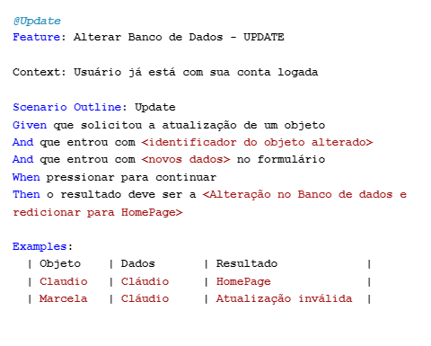
#### 1.3.2- Login
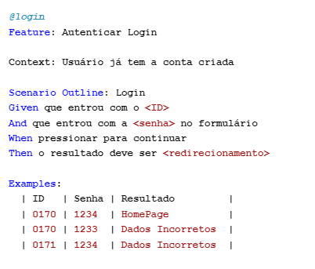
#### 1.3.3- Sign Up
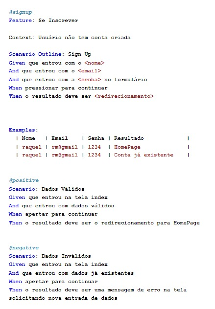

### 1.4 - Especificação de requisitos - Casos de Uso:

- **Caso de Uso UC - 01 Acessar Conta**\
    A aplicação deve ser capaz de armazenar dados de uma conta para ser acessada mais tarde.

#
- **Caso de Uso UC - 01.1 Criar conta**\
    A aplicação deve possibilitar a criação de novas contas a partir da solicitação e fornecimento de dados do usuário.
  
#
- **Caso de Uso UC - 01.1.1 dados já utilizados**\
    No momento de Sign Up a aplicação deve checar se usuário com estes dados já foi criado.

#
- **Caso de Uso UC - 01.2 Fazer login**\
    A aplicação deve permitir o acesso a uma conta existente através da autenticação de ID e Senha 

#
- **Caso de Uso UC - 01.2.1 dados inválido**\
	Deve ser negada a entrada de usuários que informaram dados inválidos (não existentes no banco ou não condizentes com seu par de identificação)
  
#
- **Caso de Uso UC - 02 Adicionar (create)**\
    A aplicação deve permitir a criação de objetos no banco de dados.

#
- **Caso de Uso UC - 02.1 Create Grupo**\
	O agrupamento  de contatos e definição de atributos do agrupamento, tais como “Descrição”, deve ser permitido através da criação de objetos Grupo.

#
- **Caso de Uso UC - 02.2 Create Contato**\
	A aplicação permite a criação e setagem de atributos de um objeto Contato.

#
- **Caso de Uso UC - 03 Read (read)**\
	A aplicação deve ser capaz de acessar e retornar os dados de todos os objetos pertencentes a uma conta.

#
- **Caso de Uso UC - 03.1 Read Grupos/ Grupo**\
	A aplicação deve ser capaz de ler os atributos ou de um grupo escolhido ou de todos os grupos pertencentes a collection “grupos” de uma conta.

#
- **Caso de Uso UC - 03.2 Read Contatos/ Contato**\
    A aplicação deve ser capaz de ler os atributos ou de um contato escolhido ou de todos os contatos pertencentes a collection “contatos” de uma conta.

#
- **Caso de Uso UC - 04 Atualizar/editar (update)**\
	Deve ser permitido o método de atualização/edição de algum objeto do banco de dados inserindo os novos dados através de formulários.

#
- **Caso de Uso UC - 04.1 Update Contato**\
	Um contato específico deve ser capaz de ser atualizado e essa solicitação será identificada quando o botão “editar” daquele contato for clicado.

#
- **Caso de Uso UC - 04.2 Update Grupo**\
    Um grupo específico deve ser capaz de ser atualizado e essa solicitação será identificada quando o botão “editar” daquele grupo for clicado.

#
- **Caso de Uso UC - 05 Deletar (delete)**\
	Para a completude do CRUD também deve ser permitido o método de deletar um objeto identificado após a confirmação do usuário.

#
- **Caso de Uso UC - 05.1 Delete Contato**\
	O contato escolhido para ser deletado será identificado através do evento de clicar no botão “deletar” daquele contato.

#
- **Caso de Uso UC - 05.2 Delete Grupo**\
    O grupo escolhido para ser deletado será identificado através do evento de clicar no botão “deletar” daquele grupo.

#
- **Caso de Uso UC - 06 Pesquisar por campo (Atributos)**\
	A aplicação deve permitir pesquisas amplas de atributos dos objetos, contatos e grupos de uma determinada conta, isso ocorreria na HomePage e seria realizado através de regular expressions.
 

## 2 - Telas do sistema

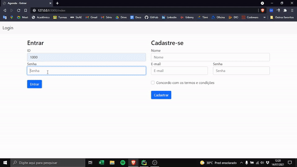

### 2.1 - Tela de Login/ Sign Up
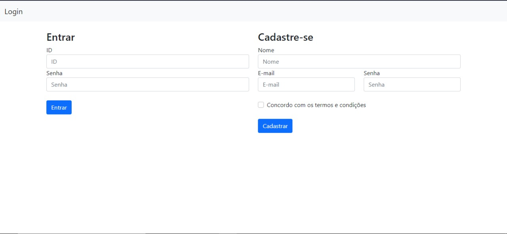

###	2.2 - Tela principal:
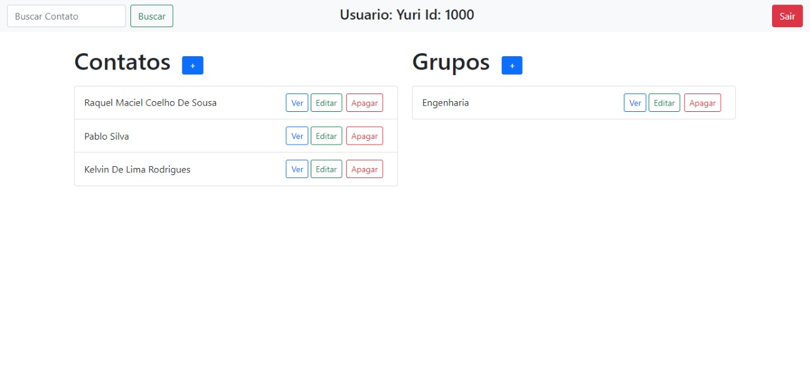

###	2.3 - Tela de criar contato:
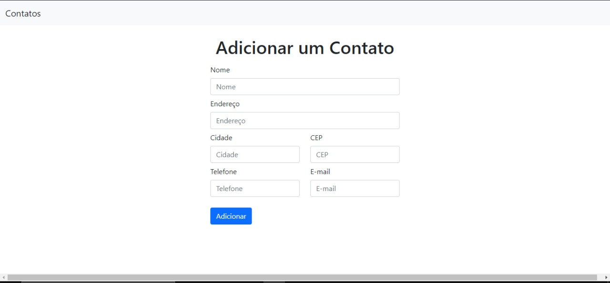

###	2.4 - Tela de criar grupo:
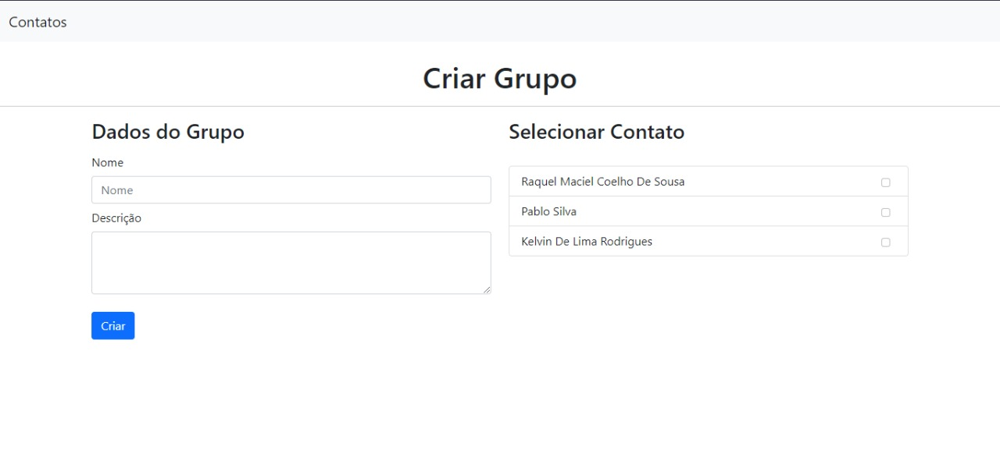

###	2.5 - Tela de editar contato:
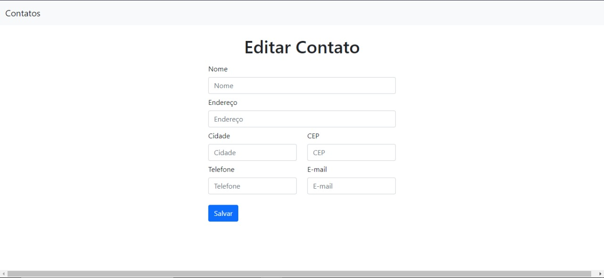

###	2.6 - Tela de editar grupo:
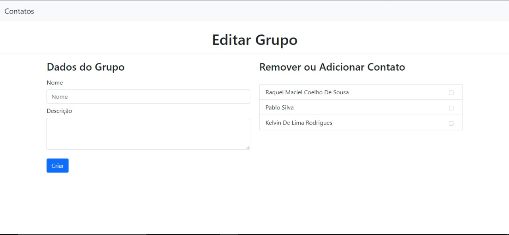

## 3 - UML 
Link Projeto com alguns diagramas: [GenMyModel](https://app.genmymodel.com/personal/projects/_zUOC4OHGEeu6V7qnWRg0WQ) \
(Restante dos diagramas foram editados no Drawio)
	
###	3.1  Casos de Uso - Diagrama e Narrativas

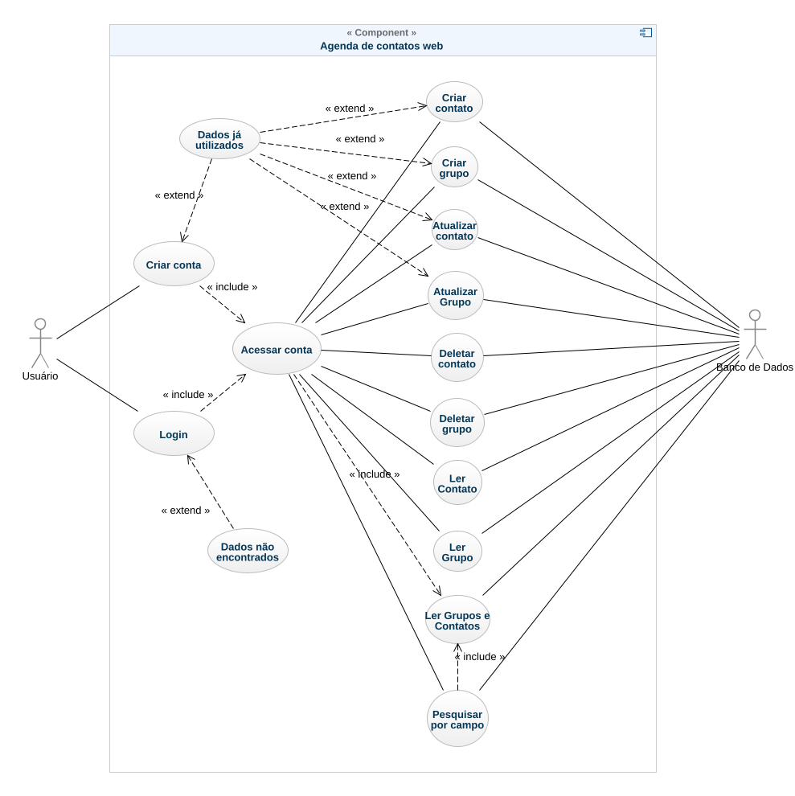

**Caso de Uso UC - 01.1 Criar conta**\
**requisitos**: Usuário não existir no banco de dados \
**ator**: Usuário \
**pré-condições**: Conta não existente no banco de dados\
**pós-condições**: Conta existente no banco de dados\
**fluxo principal**:\
1- Ator acessa a página index\
2-Ator insere nome\
3-Ator insere email\
4-Ator insere senha desejada\
5-Ator clica em botão de sign up\
6-Sistema redireciona para página Home\
7-Sistema informa ID criado para o usuário

**fluxo alternativo: Dados já utilizados**\
1- Sistema exibe mensagem de dados já utilizados\
2-Sistema retorna para tela de index\
3-Volta ao passo 2 do Fluxo Principal

#
\
**Caso de Uso UC - 01.2 Fazer login**\
**requisitos**: Usuário existir no banco de dados\
**ator**: Usuário\
**pré-condições**: Tela index\
**pós-condições**: Acessar sua conta e redirecionar para tela Home\
**fluxo principal**: \
1- Ator acessa a página index\
2-Ator insere id\
3-Ator insere senha\
4-Ator clica em botão de login\
5-Sistema exige página home

**fluxo alternativo: Dados Inválidos**\
1- Sistema exibe mensagem de dados inválidos ou não existente no banco de dados\
2- Voltar passo 2 do Fluxo Principal

#
\
**Caso de Uso UC - 02.1 Criar Grupo**\
**requisitos**: Usuário estar conectado e estar na página home\
**ator**: Usuário\
**pré-condições**: Grupo não existente no banco de dados\
**pós-condições**: Grupo existente no banco de dados\
**fluxo principal**:\
1-Ator clica no botão adicionar grupo\
2-Sistema retorna tela de criar grupo\
3-Ator insere dados do grupo\
4-Ator aperta em criar\
5-Sistema atualiza e redireciona para Home

**fluxo alternativo: Dados já utilizados**\
1- Sistema exibe mensagem de dados já utilizados\
2- Voltar para o passo 2 do fluxo principal
	
#
\
**Caso de Uso UC - 02.2 Criar Contato**\
**requisitos** : Usuário estar conectado e estar na página home\
**ator**: Usuário\
**pré-condições**: Contato não existente no banco de dados\
**pós-condições**: Contato existente no banco de dados\
**fluxo principal**:\
1-Ator clica no botão adicionar contato\
2-Sistema carrega tela de criar contato\
3-Ator insere dados do contato\
4-Ator aperta em criar\
5-Sistema atualiza e redireciona para Home

**fluxo alternativo: Dados já utilizados**\
1- Sistema exibe mensagem de dados já utilizados\
2- Voltar para o passo 2 do fluxo principal

#
\
**Caso de Uso UC - 03 Read Grupos e Contatos**\
**requisitos**: Usuário estar conectado\
**ator**: Usuário\
**pré-condições**: Não ter acesso aos seus objetos colecionados\
**pós-condições**: Acessar seus objetos \
**fluxo principal**:\
1- Ator acessa a página home\
2-Sistema mostra seus objetos salvos

#
\
**Caso de Uso UC - 03.1 Read Grupo**\
**requisitos** : Usuário estar conectado e estar na página home\
**ator**: Usuário\
**pré-condições**: Visão apenas do nome do grupo\
**pós-condições**: Visão de mais atributos do grupo\
**fluxo principal**:\
1-Ator aperta botão Ver do Grupo corresponde\
2-Sistema retorna janela de mensagem com mais atributos do grupo

#
\
**Caso de Uso UC - 03.2 Read Contato**\
**requisitos** : Usuário estar conectado e estar na página home\
**ator**: Usuário\
**pré-condições**: Visão apenas do nome do contato\
**pós-condições**: Visão de mais atributos do contato\
**fluxo principal**: \
1-Ator aperta botão Ver do Contato corresponde\
2-Sistema retorna janela de mensagem com mais atributos do Contato

#
\
**Caso de Uso UC - 04.1 Update Grupo**\
**requisitos** : Usuário estar conectado e estar na página home\
**ator**: Usuário\
**pré-condições**: grupo com seus atributos\
**pós-condições**: grupo com atributos atualizados\
**fluxo principal**: \
1-Ator aperta botão Editar do Grupo corresponde\
2-Sistema abre tela de editar grupo\
3-Ator entra com dados novos do grupo\
4-Ator aperta em salvar\
5-Sistema atualiza home e redireciona para a home

**fluxo alternativo: Dados já utilizados**\
1- Sistema exibe mensagem de dados já utilizados\
2-Retorna para o passo 2 do Fluxo Principal

#
\
**Caso de Uso UC - 04.2 Update Contato**\
**requisitos** : Usuário estar conectado e estar na página home\
**ator**: Usuário\
**pré-condições**: contato com seus atributos\
**pós-condições**: contato com atributos atualizados\
**fluxo principal**:\
1-Ator aperta botão Editar do Contato corresponde\
2-Sistema abre tela de editar contato\
3-Ator entra com dados novos do contato\
4-Ator aperta em salvar\
5-Sistema atualiza home e redireciona para a home

**fluxo alternativo: Dados já utilizados**\
1- Sistema exibe mensagem de dados já utilizados\
2-Retorna para o passo 2 do Fluxo Principal

#
\
**Caso de Uso UC - 05.1 Delete Grupo**\
**requisitos** : Usuário estar conectado e estar na página home\
**ator**: Usuário\
**pré-condições**: grupo existente\
**pós-condições**: grupo deletado\
**fluxo principal**: \
1-Ator aperta botão Deletar do Grupo corresponde\
2-Sistema pede confirmação\
3-Ator confirma\
4-Sistema redireciona e carrega pagina home

#
\
**Caso de Uso UC - 05.2 Delete Contato**\
**requisitos** : Usuário estar conectado e estar na página home\
**ator**: Usuário\
**pré-condições**: contato existente\
**pós-condições**: contato deletado\
**fluxo principal**: \
1-Ator aperta botão Deletar do Contato corresponde\
2-Sistema pede confirmação\
3-Ator confirma\
4-Sistema redireciona e carrega pagina home

#
\
**Caso de Uso UC - 06 Pesquisar por campo (Atributos)**\
**requisitos** : Usuário estar conectado e estar na página home\
**ator**: Usuário\
**pré-condições**: tela home com todos objetos\
**pós-condições**: tela home com objetos filtrados por pesquisa\
**fluxo principal**: \
1-Ator entra com pesquisa no entry de busca da página home\
2-Ator clica no botão buscar\
3-Sistema recarrega a página com resultado da pesquisa

### 3.2  Diagrama de Sequência 
####3.2.1 Geral
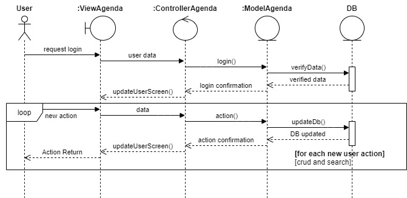

####3.2.2 Pesquisa contato
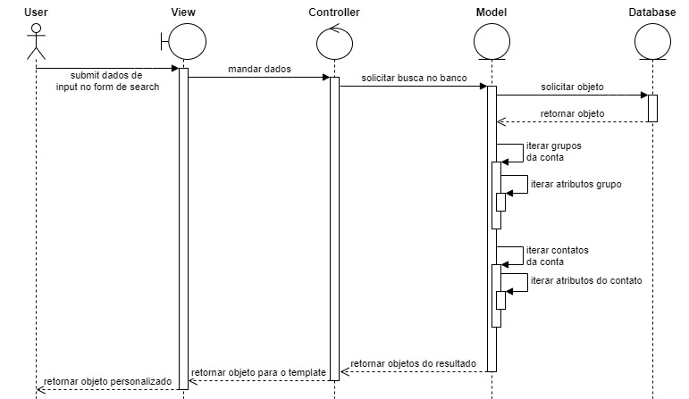

####3.2.3 Criar Grupo
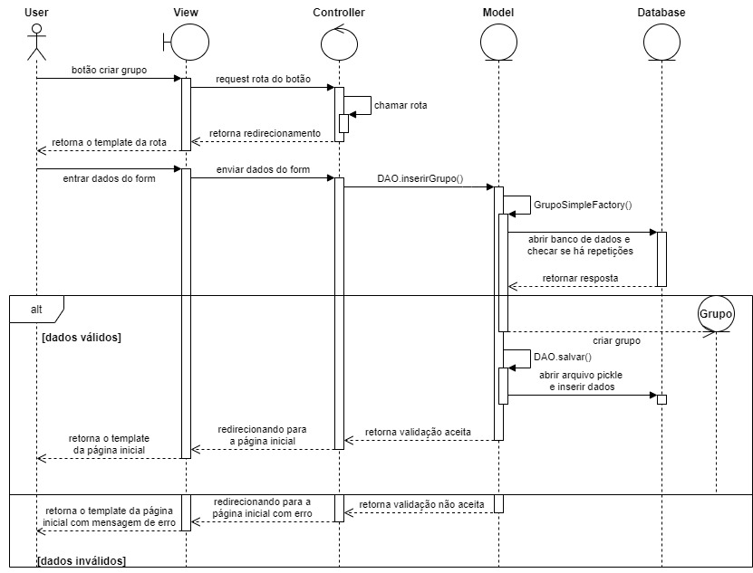

###	3.3  Diagrama de Atividade
####3.3.1 Geral
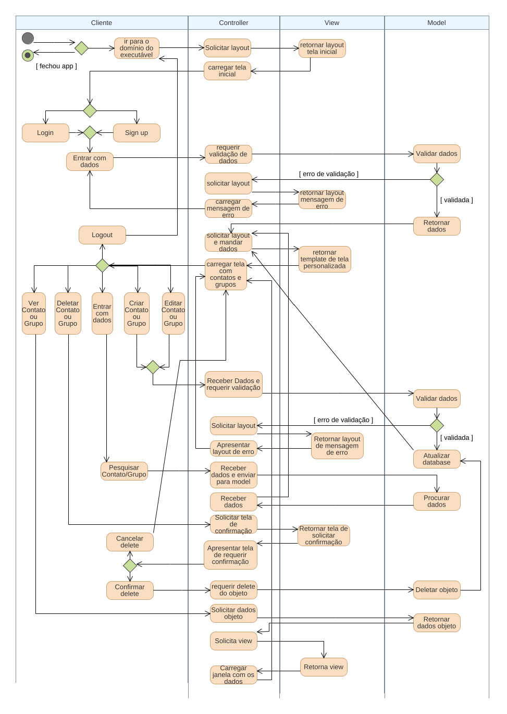

####3.3.2 Listagem de um contato
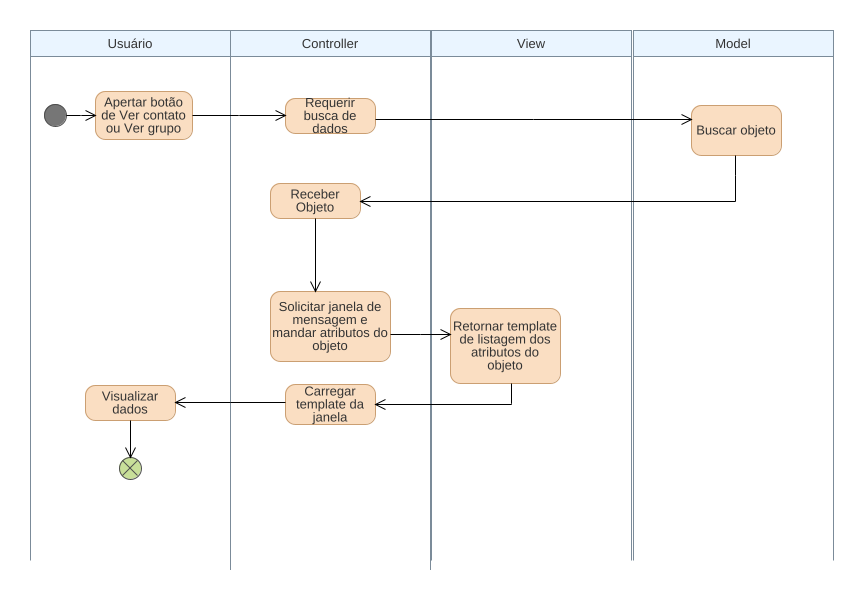

####3.3.3 Mapa de navegação de telas
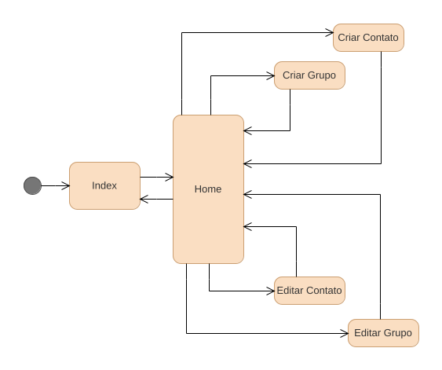

###	3.4  Diagrama de Classes
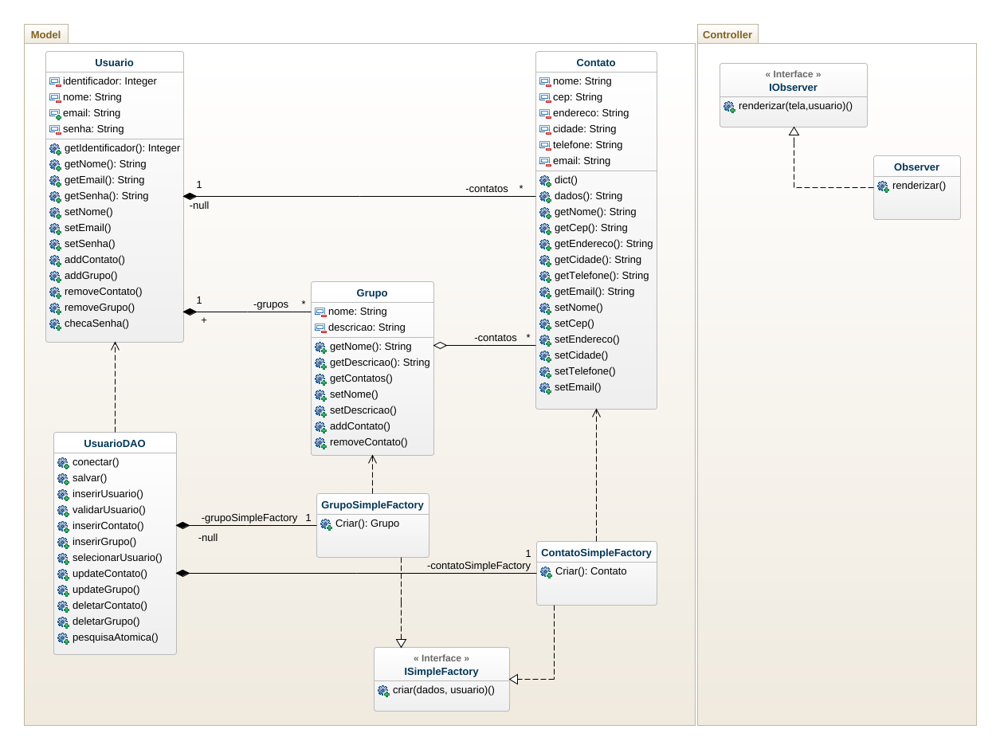

###	3.5  Diagrama de Estado (object Account)
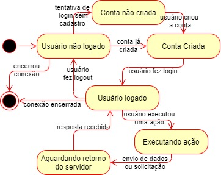

###	3.6  Diagrama de Componentes/Pacotes
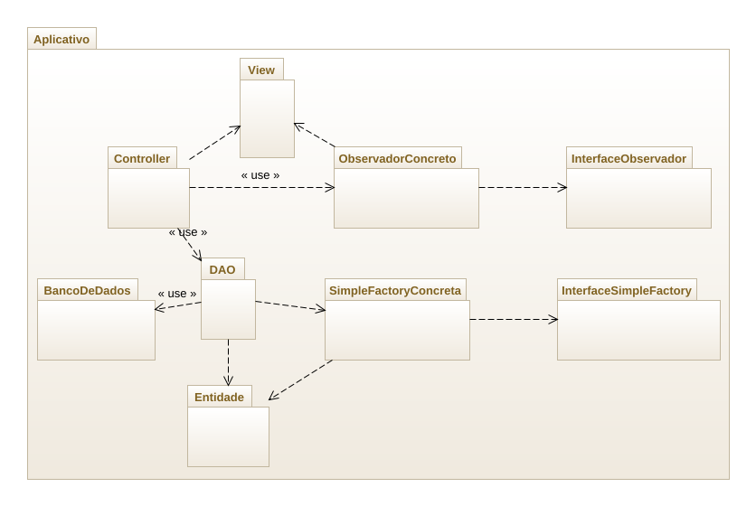

###	3.7  Diagrama de Implantação
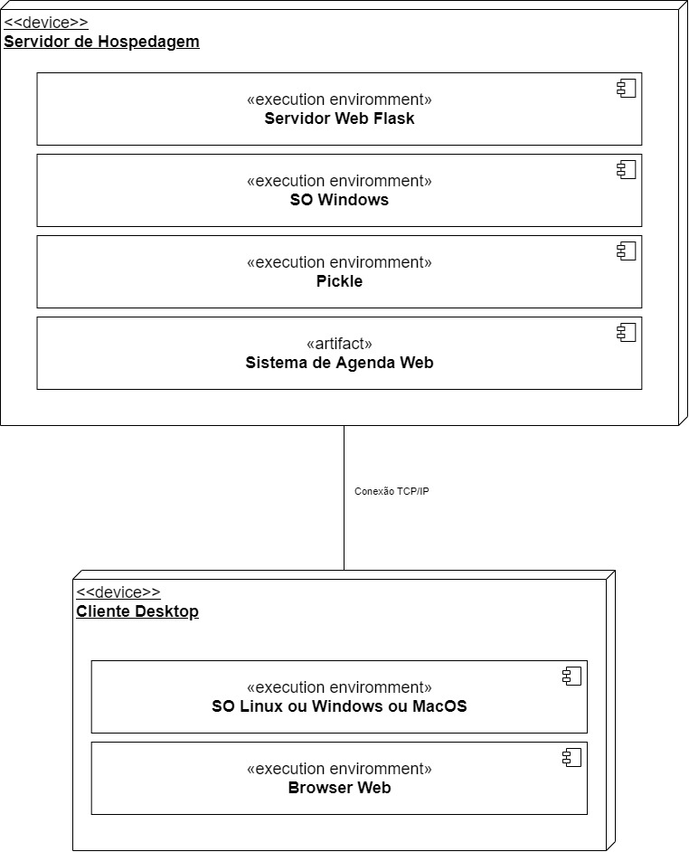

## 4 - Design Patterns

### 4.1 - Factories : [Interface Factory da Aplicação](src/models/i_simple_factory.py)
### 4.2 - Observer : [Interface Observer da Aplicação](src/controllers/i_observador.py)

## 5 -  Documentação

### Frameworks:
- [Bootstrap](https://getbootstrap.com/): Framework Web Front-End
- [Flask](https://flask.palletsprojects.com/en/2.0.x/): Micro Framework Web escrito em Python

### Editores UML:

- [GenMyModel](https://app.genmymodel.com/api/login)
- [PlantUML](http://plantuml.com/guide)
- [Drawio](https://app.diagrams.net/)

### Editores Online:
- [Gherkin](https://app.specflow.org/gherkin-editor/) 
- [README](https://readme.so/pt/editor) 

### Autores e trabalhos consultados:

- [Cap 4 Requisitos](https://drive.google.com/file/d/1q5X4nsrCui5x-Vhuh3gOeLGe90Am8-vM/view)
- [Cap 5 UML](https://drive.google.com/file/d/1kF1NHmlyUvIEi-Cu5NdQANvL2DsfGIum/view)
- [Cap 7 Design Patterns](https://drive.google.com/file/d/1EU0jzxMXd_ZWj19NvWDrgijPzZPSNXc2/view)
- [MVC](https://www.youtube.com/watch?v=jyTNhT67ZyY)
- [Lucid Chart UML](https://www.youtube.com/watch?v=rDidOn6KN9k)
- [Deschamps Factory](https://www.youtube.com/watch?v=arAz2Ff8s88)
- [Factory Method](https://pt.wikipedia.org/wiki/Factory_Method)
- [Flask Session](https://www.geeksforgeeks.org/how-to-use-flask-session-in-python-flask/)

#### (Para a ideia inicial de usar ORM ou SQL)
- [Flask SQL Alchemy](https://flask-sqlalchemy.palletsprojects.com/en/2.x/)
- [SQL Alchemy](https://www.sqlalchemy.org/) 
- [Python with SQL](https://www.w3schools.com/python/python_mysql_getstarted.asp)

